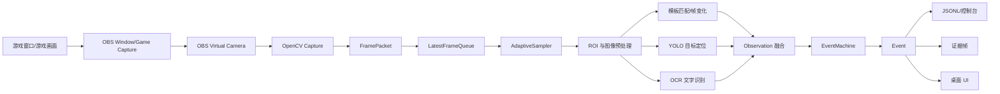

# Hoyo 游戏视频行为分析系统

> 面向《梦幻西游》游戏画面的实时视频理解与数据化记录项目。
>
> 当前版本是一个**只读、实时分析 MVP**：通过 OBS Virtual Camera 或普通视频设备获得游戏画面，使用 OpenCV 读取视频、抽帧、执行基础视觉分析，再将“打开背包、进入战斗”等候选行为转换成带时间戳的结构化事件日志。

[](https://www.python.org/)
[](https://opencv.org/)
[](https://doc.qt.io/qtforpython/)

---

## 目录

- [1. 项目背景](#1-项目背景)
- [2. 要做的事情](#2-要做的事情)
- [3. 当前范围与非目标](#3-当前范围与非目标)
- [4. 总体技术方案](#4-总体技术方案)
- [5. 当前实现状态](#5-当前实现状态)
- [6. 环境要求](#6-环境要求)
- [7. 安装](#7-安装)
- [8. 使用方式](#8-使用方式)
- [9. 配置文件](#9-配置文件)
- [10. 输出数据](#10-输出数据)
- [11. 项目文件说明](#11-项目文件说明)
- [12. 文档目录说明](#12-文档目录说明)
- [13. 开发与测试](#13-开发与测试)
- [14. 常见问题](#14-常见问题)
- [15. 后续规划](#15-后续规划)
- [16. 贡献与开发原则](#16-贡献与开发原则)

---

## 1. 项目背景

在游戏研究、直播复盘、操作统计、训练数据制作和自动化分析场景中，仅仅保存游戏视频并不方便查询。例如，用户可能希望知道：

- 什么时候启动了游戏？
- 什么时候进入了某个地图？
- 什么时候打开了背包？
- 背包里有哪些物品？
- 什么时候进入战斗？
- 使用了什么技能？
- 造成了多少伤害？

传统做法是人工观看录像并记录，成本高、效率低，也难以形成可检索的数据。本项目希望建立一条从**游戏画面到结构化事件数据**的通用技术链路：

```text
游戏画面
  → 视频采集
  → 实时抽帧
  → ROI/模板/检测/OCR
  → 观察结果
  → 时序状态机
  → 结构化事件
  → JSONL/SQLite/报表
```

项目名称中的 `hoyo` 目前只是项目目录和历史命名，不代表本项目依赖某个名为 Hoyo 的商业模型或服务。本项目当前围绕《梦幻西游》的游戏视频分析场景设计，但核心代码尽量保持通用，后续可以扩展到其他游戏或桌面应用。

---

## 2. 要做的事情

### 2.1 目标输入

项目可以接收以下输入：

1. **OBS Virtual Camera 实时视频**：当前推荐的单机 MVP 方案。
2. **普通摄像头或 HDMI 采集卡设备**：通过 OpenCV 视频设备编号读取。
3. **已经录制的视频文件**：用于离线回放、调试和制作训练数据。

典型的单机 MVP 链路如下：

```text
梦幻西游窗口
  → OBS 窗口采集/游戏采集
  → OBS Virtual Camera
  → OpenCV VideoCapture
  → 采集线程
  → 有界最新帧队列
  → 抽帧
  → 感知模块
  → 事件状态机
  → 实时界面、控制台和 JSONL
```

### 2.2 目标输出

输出不是“每一帧一条描述”，而是经过确认、去重和状态转换后的事件。例如：

```json
{
  "event_id": "evt_000001",
  "timestamp_ms": 192000,
  "timestamp": "00:03:12.000",
  "type": "map_entered",
  "status": "confirmed",
  "confidence": 0.96,
  "payload": {
    "map_name": "北俱芦洲"
  },
  "evidence_frame_index": 5760,
  "evidence_path": "runtime/evidence/000000192000_evt_000001_map_entered.jpg",
  "source": "state-machine",
  "pipeline_version": "0.1.0"
}
```

### 2.3 计划识别的游戏行为

| 行为 | 计划使用的技术 | 当前状态 |
|---|---|---|
| 游戏已打开 | 场景检测、固定区域模板匹配 | 已有事件框架，识别器仍是基础版本 |
| 进入地图 | 地图名称 ROI + OCR + 状态变化 | 待接入中文 OCR |
| 打开背包 | 背包面板模板/目标检测 | 已支持模板信号接入 |
| 背包物品 | 物品格定位 + OCR/图标分类 | 待开发 |
| 切入战斗 | 战斗 UI 检测 + 多帧确认 | 已有状态机规则 |
| 使用技能 | 技能区域变化 + 技能名 OCR/图标分类 | 待开发 |
| 伤害数字 | 伤害数字 ROI + OCR + 时间关联 | 待开发 |
| 任务流程 | 多个事件组合成任务状态机 | 后续阶段开发 |

---

## 3. 当前范围与非目标

### 3.1 当前范围

当前项目优先解决以下问题：

- 在 Windows 上稳定接收实时视频。
- 将视频帧转换为统一的 `FramePacket`。
- 通过时间戳进行抽帧，避免每一帧都执行高成本识别。
- 在采集速度和分析速度不一致时控制队列长度，避免延迟无限累积。
- 将模板匹配、帧变化和未来的 YOLO/OCR 结果统一为 `Observation`。
- 通过连续帧确认、冷却时间和状态转换生成事件。
- 将事件实时输出到桌面 UI、控制台和 JSONL 文件。
- 保存事件对应的证据帧，便于回放和纠错。

### 3.2 当前非目标

当前版本明确不做以下事情：

- 不读取游戏进程内存。
- 不向游戏进程注入 DLL 或修改游戏数据。
- 不模拟键盘、鼠标或游戏内操作。
- 不自动领取任务、移动角色、战斗或执行交易。
- 不承诺当前版本能够准确识别所有地图、物品、技能和伤害数字。
- 不在每一帧调用视觉大模型 API。
- 不把整个游戏视频直接交给大模型，让大模型自行完成所有识别。

后续如需研究自动操作，应仅在自建模拟界面、测试环境或明确授权的场景中进行，并单独设计动作白名单、暂停机制、回滚和安全边界。

---

## 4. 总体技术方案

### 4.1 模块化数据流



### 4.2 观察、状态和事件三层模型

项目不应该把“某一帧看到了一个文字”直接当作业务事件，而是分为三层：

#### Observation：单帧观察结果

由视觉算法直接产生，例如：

```python
{
    "battle_active": True,
    "map_name": "北俱芦洲",
    "damage_amount": 12445,
}
```

#### State：经过时序确认的当前状态

例如：

```text
current_scene = world_map
map_name = 北俱芦洲
inventory_open = True
battle_active = False
```

#### Event：状态发生变化后的业务事件

例如：

```text
map_entered
inventory_opened
inventory_closed
battle_started
battle_ended
skill_used
damage_dealt
```

这样可以过滤单帧误检、OCR 短暂错误和 UI 闪烁。

### 4.3 为什么使用抽帧和有界队列

游戏画面可能是 30 或 60 FPS，但第一版不需要对每一帧都进行完整识别：

- 普通场景：默认约 5 FPS。
- 战斗场景：可提高到约 10 FPS。
- 短时间高频变化：可提高到约 20 FPS。
- 实时队列有最大长度，分析速度跟不上时丢弃旧帧，优先处理最新画面。

这样做的主要目标是**控制实时延迟**，而不是让所有原始帧都进入推理队列。

### 4.4 YOLO、OCR 和视觉大模型的分工

后续完整识别链路建议如下：

```text
YOLO：定位区域和目标
  → 例如背包面板、物品格、技能区域、伤害数字区域

OCR：读取文字
  → 例如地图名称、物品名称、技能名称、伤害数值

模板/规则：确认稳定 UI 状态
  → 例如游戏是否打开、背包是否打开、是否进入战斗

EventMachine：完成时间和业务逻辑判断
  → 例如连续两帧确认后才输出 inventory_opened
```

视觉大模型不是第一版必需组件。它更适合用于：

- 离线分析复杂截图。
- 辅助生成标注建议。
- 处理规则难以覆盖的特殊 UI。
- 对低置信度事件生成解释。

不建议在实时主链路中对每一帧调用远程视觉大模型，否则会带来延迟、费用、网络依赖和结果不稳定等问题。

---

## 5. 当前实现状态

当前版本已经完成以下基础能力：

- OBS Virtual Camera、普通摄像头和采集卡统一使用 OpenCV 读取。
- 视频文件离线读取。
- 采集线程与分析线程分离。
- 有界最新帧队列。
- 基于时间戳的自适应抽帧器。
- ROI 裁剪和边界保护。
- 帧变化检测。
- 可选 OpenCV 模板匹配。
- 连续多帧确认的事件状态机。
- JSONL 事件输出和控制台输出。
- 事件证据帧保存。
- PySide6 Windows 桌面界面。
- OBS 进程状态检测。
- 实时视频预览。
- 采集帧数、分析帧数、丢帧数和分析 FPS 展示。

### 当前识别能力边界

当前仓库没有内置训练好的《梦幻西游》YOLO 权重，也没有默认中文 OCR 引擎和完整游戏词典。因此，当前版本的重点是验证工程链路：

```text
视频能否接入
→ 是否能够实时抽帧
→ 识别结果能否进入状态机
→ 事件能否实时输出
→ 证据能否保存
```

当前的 `RuleBasedPerception` 可以处理帧变化和配置的模板匹配，但不会凭空识别出“北俱芦洲”“导标旗”或“横扫千军”。

---

## 6. 环境要求

### 必需环境

- Windows 10/11，推荐使用 Windows 11。
- Python 3.11 或更高版本。
- [uv](https://docs.astral.sh/uv/)：用于创建环境、安装依赖和运行项目。
- OBS Studio：仅当使用 OBS Virtual Camera 时需要。
- 摄像头、OBS Virtual Camera 或 HDMI 采集卡中的任意一种视频输入设备。

### Python 依赖

项目运行依赖：

- `numpy`：数组和基础数值处理。
- `opencv-python`：视频读取、图像处理、模板匹配和图片保存。
- `PySide6`：Windows 桌面界面。

开发依赖：

- `pytest`：自动化测试。
- `ruff`：代码检查和格式化。

YOLO、OCR、SQLite 等后续能力暂未作为当前版本的强制依赖，以避免在 MVP 阶段过早引入大量复杂组件。

---

## 7. 安装

### 7.1 使用 uv 安装（推荐）

在 PowerShell 中执行：

```powershell
cd C:\Users\李锐\Documents\hoyo-test
uv sync --dev
```

该命令会根据 `pyproject.toml` 和 `uv.lock` 创建或更新虚拟环境，并安装运行及开发依赖。

### 7.2 使用传统 venv

如果不使用 uv，可以执行：

```powershell
cd C:\Users\李锐\Documents\hoyo-test
python -m venv .venv
.\.venv\Scripts\Activate.ps1
python -m pip install -e .
python -m pip install pytest ruff
```

### 7.3 检查安装是否成功

```powershell
uv run python -c "import cv2, numpy; print('OpenCV and NumPy ok')"
uv run python -c "import PySide6; print('PySide6 ok')"
uv run python -m hoyo_analyzer --help
```

---

## 8. 使用方式

### 8.1 启动桌面界面

推荐使用桌面界面进行第一次操作：

```powershell
cd C:\Users\李锐\Documents\hoyo-test
uv run python -m hoyo_analyzer desktop
```

界面包含以下区域：

| 区域 | 作用 |
|---|---|
| 实时输入 | 选择 OBS Virtual Camera、HDMI 采集卡或普通摄像头，填写设备号 |
| 刷新设备 | 扫描 OpenCV 可以打开的视频设备编号 |
| 测试设备 | 尝试读取一帧，提前确认设备编号和视频源可用 |
| 开始实时分析 | 启动采集线程、分析线程和事件输出 |
| 停止分析 | 停止实时分析并释放视频设备 |
| 视频预览 | 显示最近收到的视频帧 |
| 运行状态 | 显示 OBS、视频采集和事件输出状态 |
| 事件列表 | 显示本次运行过程中产生的结构化事件 |
| 调试日志 | 显示设备扫描、启动、停止和异常信息 |

#### OBS Virtual Camera 使用步骤

1. 打开 OBS Studio。
2. 新建一个场景。
3. 添加“窗口采集”或“游戏采集”。
4. 选择梦幻西游窗口。
5. 确认 OBS 预览中能看到完整游戏画面。
6. 点击“启动虚拟摄像机”。
7. 启动本项目桌面界面。
8. 点击“刷新设备”。
9. 选择 `OBS Virtual Camera` 和对应设备编号。
10. 点击“测试设备”。
11. 测试成功后点击“开始实时分析”。

当前界面有启动保护：选择 `OBS Virtual Camera` 时，如果没有检测到 `obs64.exe` 或 `obs.exe`，开始按钮会被禁用；即使在按钮状态刷新间隔内点击，也会再次拦截启动。

注意：

> “OBS 进程运行中”不等于“虚拟摄像机已经启动”。最终应该同时确认 OBS 预览正常、设备测试成功、视频预览有画面，并且“视频采集”状态显示“正常采集”。

### 8.2 枚举视频设备

```powershell
uv run python -m hoyo_analyzer list-devices --max-index 10
```

示例输出：

```text
可用视频设备：0, 1, 2
```

设备编号由 Windows 和 OpenCV 的设备枚举结果决定，在不同电脑上可能不同。OBS Virtual Camera 不一定是设备 `0`，请以实际输出为准。

### 8.3 使用 CLI 实时分析

如果不需要桌面界面，可以直接执行：

```powershell
uv run python -m hoyo_analyzer live `
  --source obs-virtual-camera `
  --device 1 `
  --config configs/default.toml
```

可选参数：

```text
--source       obs-virtual-camera、capture-card、camera、screen
--device       OpenCV 视频设备编号，默认 0
--config       TOML 配置文件路径
--max-seconds  运行指定秒数后自动退出，适合调试
--queue-size   覆盖实时队列长度
```

例如运行 60 秒：

```powershell
uv run python -m hoyo_analyzer live `
  --source obs-virtual-camera `
  --device 1 `
  --config configs/default.toml `
  --max-seconds 60
```

### 8.4 离线分析视频

实时分析不是必须保存视频，但在开发阶段建议保留少量测试视频，用于复现问题、制作证据和训练数据。

```powershell
uv run python -m hoyo_analyzer analyze-video `
  recordings/demo.mp4 `
  --config configs/default.toml
```

离线分析会读取视频、根据抽帧配置执行感知和事件分析，并将事件写入 JSONL。

### 8.5 从视频抽取图片

```powershell
uv run python -m hoyo_analyzer extract-frames `
  recordings/demo.mp4 `
  --fps 5 `
  --output-dir runtime/frames
```

抽出的图片名称包含帧号和时间戳，例如：

```text
00000120_000000004000.jpg
```

其中：

- `00000120`：视频帧编号。
- `000000004000`：相对视频起点的毫秒时间戳。

抽帧图片适合用于：

- 检查画面是否正确。
- 选取模板匹配素材。
- 制作 YOLO/OCR 标注数据。
- 分析误检和漏检。

---

## 9. 配置文件

默认配置文件：

```text
configs/default.toml
```

当前内容：

```toml
[capture]
source = "video"
path = "recordings/demo.mp4"
device_index = 0
source_id = "obs"

[sampling]
normal_fps = 5.0
battle_fps = 10.0
burst_fps = 20.0
burst_duration_ms = 1500
queue_size = 120

[evidence]
pre_buffer_ms = 2000
post_buffer_ms = 3000
directory = "runtime/evidence"

[output]
event_log = "runtime/events/events.jsonl"
console = true
```

### 9.1 `[capture]`

| 配置项 | 含义 | 当前说明 |
|---|---|---|
| `source` | 默认输入类型 | 当前 CLI 会根据命令和参数选择输入 |
| `path` | 视频文件路径 | 离线视频输入使用；实时设备输入时不会使用该路径 |
| `device_index` | 视频设备编号 | GUI 和 CLI 可单独覆盖 |
| `source_id` | 输入源标识 | 写入帧的元数据，便于区分来源 |

### 9.2 `[sampling]`

| 配置项 | 含义 | 默认值 |
|---|---|---:|
| `normal_fps` | 普通场景分析频率 | 5 |
| `battle_fps` | 战斗场景分析频率 | 10 |
| `burst_fps` | 短时间突发分析频率 | 20 |
| `burst_duration_ms` | 突发模式持续时间 | 1500 |
| `queue_size` | 实时最新帧队列最大长度 | 120 |

### 9.3 `[evidence]`

| 配置项 | 含义 |
|---|---|
| `pre_buffer_ms` | 事件发生前保留的时间范围，目前用于维护证据缓冲 |
| `post_buffer_ms` | 事件发生后保留的时间范围，后续片段保存功能使用 |
| `directory` | 证据图片输出目录 |

### 9.4 `[output]`

| 配置项 | 含义 |
|---|---|
| `event_log` | JSONL 事件日志路径 |
| `console` | 是否同时输出可读的控制台日志 |

### 9.5 模板匹配配置

可以在配置文件末尾加入：

```toml
[templates]
game_visible = "assets/templates/game_visible.png"
inventory_open = "assets/templates/inventory_open.png"
battle_active = "assets/templates/battle_active.png"
```

配置键会作为 `signal` 进入 `Observation`，然后交给 `EventMachine`。模板图片需要由开发者自行截取和准备，当前仓库没有提供梦幻西游模板图片或训练权重。

---

## 10. 输出数据

### 10.1 JSONL 事件日志

默认输出文件：

```text
runtime/events/events.jsonl
```

JSONL 的特点是每行一个 JSON 对象，适合追加写入、流式处理和后续导入数据库。

事件字段说明：

| 字段 | 含义 |
|---|---|
| `event_id` | 当前运行中的事件编号 |
| `timestamp_ms` | 相对视频或输入流起点的毫秒时间戳 |
| `timestamp` | 便于阅读的 `HH:MM:SS.mmm` 时间 |
| `type` | 事件类型，例如 `battle_started` |
| `status` | `confirmed` 或 `updated` |
| `confidence` | 当前识别置信度 |
| `payload` | 事件业务数据，例如地图名、物品列表、伤害数值 |
| `evidence_frame_index` | 触发事件的证据帧编号 |
| `evidence_path` | 证据图片路径 |
| `source` | 事件来源标识 |
| `pipeline_version` | 处理管线版本 |

### 10.2 当前事件类型

当前状态机内置或支持以下事件：

```text
application_opened
inventory_opened
inventory_closed
battle_started
battle_ended
map_entered
inventory_items_read
skill_used
damage_dealt
```

其中部分事件需要感知模块提供对应信号后才会实际产生。例如没有 OCR 模块提供 `map_name` 时，不会产生有效的 `map_entered` 地图名称事件。

### 10.3 证据帧

默认目录：

```text
runtime/evidence/
```

当状态机产生事件时，`EvidenceWriter` 会尝试保存触发事件的图像，并把路径写入事件对象。证据帧用于：

- 人工核对识别是否正确。
- 分析误报和漏报。
- 制作后续训练集。
- 对事件规则进行回放调试。

运行时数据被 `.gitignore` 忽略，不应把大量视频、图片和日志提交到 Git 仓库。

---

## 11. 项目文件说明

### 11.1 根目录文件

| 文件/目录 | 作用 |
|---|---|
| `README.md` | 项目背景、架构、安装、运行、配置和开发说明 |
| `pyproject.toml` | 项目元数据、Python 版本、运行依赖、开发依赖、pytest 和 Ruff 配置 |
| `uv.lock` | uv 锁定的依赖版本，保证不同环境尽量使用一致的依赖 |
| `.gitignore` | 忽略虚拟环境、缓存、运行时日志、录制视频和图片等本地文件 |
| `configs/` | TOML 配置文件目录 |
| `docs/` | 项目定义、技术架构、数据方案和路线图文档 |
| `src/` | Python 源代码目录 |
| `tests/` | 自动化测试目录 |
| `runtime/` | 程序运行时生成的日志、证据帧和调试帧，不纳入 Git |

### 11.2 `src/hoyo_analyzer/` 文件

| 文件 | 作用 |
|---|---|
| `__init__.py` | 定义 `hoyo_analyzer` Python 包和当前版本号 |
| `__main__.py` | 支持 `python -m hoyo_analyzer`，将命令转交给 CLI |
| `models.py` | 定义核心数据结构：`FramePacket`、`Observation`、`Event`、`RuntimeState` 等 |
| `config.py` | 定义配置数据类，并从 TOML 文件加载配置 |
| `capture.py` | 视频输入适配层；负责视频文件、OBS Virtual Camera、普通摄像头和采集卡的 OpenCV 读取 |
| `obs.py` | Windows OBS 进程状态检测，目前检测 `obs64.exe` 和 `obs.exe` |
| `sampler.py` | 抽帧策略和 `LatestFrameQueue` 有界最新帧队列 |
| `realtime.py` | 实时分析主流程；组织采集线程、队列、抽帧、感知、状态机和输出 |
| `roi.py` | 提供像素 ROI、相对比例 ROI 和安全裁剪函数 |
| `perception.py` | 当前基础感知实现；包含帧变化检测和可选 OpenCV 模板匹配 |
| `ocr.py` | OCR 接口协议、OCR 结果结构和当前的空 OCR 实现 `NullOcrEngine` |
| `event_machine.py` | 时序状态机；对观察信号执行多帧确认、进入/退出事件、去重和冷却控制 |
| `evidence.py` | 保存事件触发时的证据图像 |
| `storage.py` | JSONL 事件写入、控制台输出和多个输出通道组合 |
| `cli.py` | 命令行参数、离线分析、实时分析、设备枚举、抽帧和桌面入口 |
| `gui.py` | PySide6 桌面 UI、实时视频预览、状态监控、事件表格和后台分析线程 |

### 11.3 `tests/` 文件

| 文件 | 测试内容 |
|---|---|
| `test_models.py` | 时间戳格式和 `FramePacket` 基础行为 |
| `test_event_machine.py` | 背包、战斗和地图事件的状态确认与去重 |
| `test_realtime.py` | 实时分析器、视频源工厂和事件输出 |
| `test_sampler.py` | 抽帧频率和有界队列丢弃旧帧行为 |
| `test_roi.py` | ROI 越界裁剪和相对比例转换 |
| `test_storage.py` | JSONL UTF-8 写入和控制台输出 |

### 11.4 `docs/` 文件

详细设计文档见[文档目录说明](#12-文档目录说明)。

---

## 12. 文档目录说明

| 文档 | 内容 |
|---|---|
| [`docs/01-project-definition.md`](docs/01-project-definition.md) | 项目输入、输出、识别目标、观察/状态/事件三层模型 |
| [`docs/02-architecture.md`](docs/02-architecture.md) | 总体技术架构、模块边界、进程建议和可观测指标 |
| [`docs/03-video-ingest-and-frame-extraction.md`](docs/03-video-ingest-and-frame-extraction.md) | 视频输入、时间戳、抽帧、队列和延迟控制 |
| [`docs/04-event-recognition.md`](docs/04-event-recognition.md) | 地图、背包、战斗、技能、伤害等事件的识别方案 |
| [`docs/05-model-selection.md`](docs/05-model-selection.md) | 规则、模板、OCR、YOLO 和视觉大模型的选型建议 |
| [`docs/06-data-schema.md`](docs/06-data-schema.md) | Observation、Event、JSONL、SQLite 和后续数据模型设计 |
| [`docs/07-roadmap-and-mvp.md`](docs/07-roadmap-and-mvp.md) | MVP 路线图、阶段目标、验收标准和不建议过早做的事情 |

建议阅读顺序：

```text
README.md
  → 01-project-definition.md
  → 02-architecture.md
  → 03-video-ingest-and-frame-extraction.md
  → 04-event-recognition.md
  → 05-model-selection.md
  → 06-data-schema.md
  → 07-roadmap-and-mvp.md
```

---

## 13. 开发与测试

### 13.1 运行自动化测试

```powershell
uv run pytest -q
```

### 13.2 运行代码检查

```powershell
uv run ruff check .
```

### 13.3 自动格式化

```powershell
uv run ruff format .
```

### 13.4 完整验证

```powershell
uv run ruff check .
uv run pytest -q
uv run python -m hoyo_analyzer --help
uv run python -m hoyo_analyzer desktop --help
```

### 13.5 测试实时链路的建议顺序

1. 先使用 `list-devices` 确认系统能看到视频设备。
2. 再使用桌面界面的“测试设备”读取一帧。
3. 确认视频预览能显示画面。
4. 运行 1～5 分钟，观察采集 FPS、分析 FPS 和丢帧数。
5. 检查 `runtime/events/events.jsonl` 是否持续写入。
6. 检查 `runtime/evidence/` 是否产生事件证据图。
7. 使用一段录制视频进行离线复现，比较实时和离线结果。

### 13.6 添加新的识别信号

建议遵循以下步骤：

```text
1. 定义 Observation 信号
2. 实现模板、规则、YOLO 或 OCR 适配器
3. 在 perception.py 中输出信号
4. 在 event_machine.py 中增加状态转换规则
5. 增加证据帧和 JSONL 字段
6. 添加自动化测试
7. 用未参与训练的视频段进行回放验证
```

不要直接在 GUI 中写识别逻辑。GUI 只负责展示状态、启动/停止任务和接收回调，识别逻辑应该保持在感知层和事件层。

---

## 14. 常见问题

### 14.1 OBS 进程显示“未检测到”

请确认任务管理器中存在：

```text
obs64.exe
```

或：

```text
obs.exe
```

如果 OBS 使用了特殊启动方式或进程名不同，需要后续扩展 [`src/hoyo_analyzer/obs.py`](src/hoyo_analyzer/obs.py) 的检测逻辑。

### 14.2 OBS 运行中，但视频采集仍然失败

OBS 进程运行中不代表虚拟摄像机已启动。请依次确认：

1. OBS 预览中有游戏画面。
2. 已点击“启动虚拟摄像机”。
3. 已在项目中点击“刷新设备”。
4. 设备编号填写正确。
5. 没有其他程序独占该摄像头设备。
6. OBS 和分析程序的权限级别没有造成设备访问限制。

### 14.3 视频设备编号不确定

执行：

```powershell
uv run python -m hoyo_analyzer list-devices --max-index 10
```

然后逐个使用桌面界面的“测试设备”。不同电脑的编号可能不同，不能固定假设 OBS Virtual Camera 一定是 `0` 或 `1`。

### 14.4 画面有预览，但没有事件

这是当前版本的预期现象之一。请确认：

- `configs/default.toml` 中是否配置了有效模板。
- 模板图片路径是否正确。
- 当前是否已经接入真实 OCR。
- 当前是否已经接入 YOLO 权重。
- `perception.py` 是否输出了 `EventMachine` 需要的信号。

只接入视频并不会自动获得地图、物品、技能或伤害语义。

### 14.5 丢帧数增加是否一定是错误

不一定。实时队列的设计是优先处理最新画面。当分析速度低于采集速度时，程序会丢弃旧帧来避免延迟越来越大。

如果丢帧过多，可以尝试：

- 降低输入分辨率。
- 降低 `normal_fps`。
- 缩小 ROI。
- 使用更轻量的模型。
- 减少每帧执行的 OCR 次数。
- 调整 `queue_size`，但不要无限增大队列。

### 14.6 是否必须保存视频

不必须。MVP 主链路是实时分析：

```text
OBS Virtual Camera → OpenCV → 实时分析
```

保存视频是可选旁路，主要用于：

- 问题复现。
- 离线回放。
- 制作训练数据。
- 识别结果人工复核。

---

## 15. 后续规划

### 阶段 0：稳定视频输入（1～2 天）

目标：不使用 AI 也能稳定获取画面。

- 完成 OBS Virtual Camera 实际连接。
- 确认分辨率、FPS、色彩格式和延迟。
- 连续运行 30 分钟观察断流、黑屏和重连。
- 完善视频设备错误提示和恢复机制。

验收标准：可以稳定采集，能够记录采集帧数、分析帧数、丢帧数和错误。

### 阶段 1：完善抽帧与证据链（2～3 天）

- 增加按场景变化触发的自适应抽帧。
- 完善事件前后证据帧保存。
- 支持断线和恢复后的时间戳处理。
- 增加 ROI 调试导出。

验收标准：同一段视频能够复现稳定的帧号、时间戳和证据图片。

### 阶段 2：先做规则、模板和 OCR（3～7 天）

第一版不急于训练 YOLO，先使用稳定、可解释的方法：

- 游戏主界面模板。
- 背包面板模板。
- 战斗 UI 模板。
- 地图名称固定 ROI。
- 伤害数字固定 ROI。
- 中文 OCR。
- 文本清洗、白名单和常见错字纠正。

验收标准：能够在短视频上输出游戏打开、地图变化、背包打开和战斗开始等候选事件。

### 阶段 3：收集数据并训练轻量 YOLO（1～2 周）

建议优先标注区域和目标，而不是把所有文字和物品名称都做成 YOLO 类别：

```text
inventory_panel
battle_panel
skill_region
item_slot
map_name_region
damage_region
```

流程：

```text
录制/采集 → 抽帧 → 去重 → 标注 → train/val/test 划分
→ 训练 → 评估 → 未见视频段回放 → 修正数据
```

数据集应该按“视频段”划分，而不是把相邻帧随机拆到训练集和验证集，否则评估指标可能虚高。

### 阶段 4：接入真实 OCR 和识别融合（约 1 周）

- 接入中文 OCR 引擎。
- 增加地图、物品、技能和数字的文本清洗。
- 将 YOLO 的区域定位结果传给 OCR。
- 将 OCR 结果与模板、帧变化和状态机融合。
- 保留原始文本、归一化文本和置信度。

### 阶段 5：完善事件引擎（约 1 周）

- 增加场景、地图、面板、战斗和回合状态。
- 增加技能与伤害的时间关联。
- 增加事件去重和冷却时间。
- 增加低置信度人工复核标记。
- 增加任务级事件，例如“师门任务开始/完成”。

### 阶段 6：离线回放和评估（约 1 周）

建立回放工具，显示：

- 原始画面。
- ROI 区域。
- YOLO 检测框和置信度。
- OCR 原文和归一化文本。
- 当前状态。
- 已输出事件。

评估指标至少包括：

```text
事件精确率 = 正确输出事件数 / 输出事件总数
事件召回率 = 正确识别事件数 / 真值事件总数
时间误差   = 预测事件时间 - 人工标注时间
```

不要只看 YOLO mAP 或 OCR 字符准确率，最终要看业务事件是否正确。

### 阶段 7：数据查询和报表

- 将 JSONL 导入 SQLite。
- 支持按日期、地图、战斗和事件类型查询。
- 统计技能使用次数和伤害。
- 生成游戏行为时间线。
- 对低置信度事件提供人工修正。

### 后续架构演进

MVP 阶段保持单机、单进程、多线程：

```text
capture thread → bounded queue → inference worker → event writer
```

规模变大后再考虑拆分为：

```text
capture_service
perception_service
event_service
review_tool
```

不建议在识别链路尚未稳定前过早微服务化。

---

## 16. 贡献与开发原则

### 16.1 先闭环，再追求模型复杂度

优先完成：

```text
采集 → 抽帧 → 一个可靠信号 → 一个事件 → 一条日志 → 一张证据图
```

然后再逐步增加识别种类。

### 16.2 每个识别结果都要可解释

事件应尽可能保留：

- 时间戳。
- 证据帧。
- 识别来源。
- 模型或规则版本。
- 置信度。
- 原始文本。
- 归一化文本。

### 16.3 不要用单帧结论直接驱动业务事件

应通过连续帧、时间窗口、冷却时间和上下文状态减少误报。

### 16.4 训练集和验证集必须按视频段隔离

相邻视频帧高度相似。如果随机拆分相邻帧，模型可能只是记住画面，而不是学会泛化。

### 16.5 控制运行时数据体积

视频、原始帧、证据图和日志默认保存在 `runtime/` 或 `recordings/`，这些目录已被 Git 忽略。提交代码时只提交必要的配置、文档、测试和小型示例。

### 16.6 版本提交建议

每次增加能力时，建议按以下顺序提交：

```text
1. 先提交数据模型或接口
2. 再提交实现
3. 添加测试
4. 更新 README 或 docs
5. 执行 pytest 和 ruff
6. 最后提交和推送
```

---

## 当前项目一句话总结

这是一个以 OBS Virtual Camera 为实时视频入口、以 OpenCV 为采集和图像处理基础、以 YOLO/OCR/模板匹配为可插拔感知手段、以时序状态机为事件确认核心、最终将《梦幻西游》游戏画面转换为可查询结构化数据的工程化 MVP。
