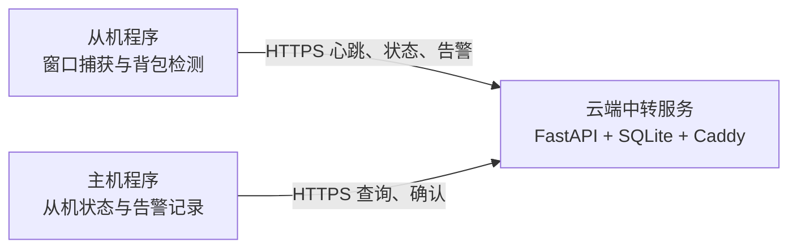

# 梦幻西游背包监控

这是一个面向 Windows 的《梦幻西游》多窗口背包监控系统。每台从机最多监控 8 个游戏窗口，本地判断背包是否打开、是否已满，并可通过 HTTPS 云端中转把状态和告警发送到主机。

当前桌面产品入口只保留背包监控，不展示装备识别、OCR、YOLO、聊天室、商行或个人中心等历史实验功能。核心检测使用 OpenCV，在本机完成，不上传游戏截图。

## 系统组成


```mermaid
flowchart LR
    S[从机程序<br/>窗口捕获与背包检测] -->|HTTPS 心跳、状态、告警| R[云端中转服务<br/>FastAPI + SQLite + Caddy]
    M[主机程序<br/>从机状态与告警记录] -->|HTTPS 查询、确认| R
```

- **从机程序**：运行在游戏电脑上，负责最多 8 个窗口的捕获、检测和本地告警；断网时仍可独立工作。
- **云端中转服务**：保存设备心跳、最新窗口状态和告警记录，不保存游戏截图。
- **主机程序**：展示所有从机窗口的最新状态，接收告警并标记为已处理。

## 当前能力

- 手动添加 0～8 个标题包含“梦幻西游 ONLINE”的窗口，拦截其他程序窗口。
- 从窗口标题解析二级区名、角色名和角色 ID。
- 检测背包未打开、未满、接近满、已满和被游戏界面遮挡。
- 检测 Windows 窗口最小化及遮挡比例。
- 所有异常连续保持约 5 秒后才告警，减少游戏临时提示造成的误报。
- 支持暂停/恢复监控、后台监控以及右下角持久告警弹窗。
- 支持仅弹窗或弹窗并循环播放声音，用户确认后才停止。
- 从机每 5 秒上报状态；主机保留未处理和已处理告警记录。

## 程序会判断什么

- `背包未打开`：画面中没有检测到完整背包，提醒员工打开背包。
- `背包未满`：背包中仍有空格。
- `背包接近满`：只剩很少的空格。
- `背包容量`：默认在 20 个格子全部占用时警告，也可以设置为剩余 1～20 格时提前警告。
- `背包被遮挡，无法检测`：背包打开但被聊天、属性或其他界面遮挡，提醒员工处理。
- `检测已暂停`：游戏窗口被最小化；恢复窗口后自动继续，最小化期间不会沿用旧画面更新背包结论。
- `窗口遮挡`：每 2 秒根据 Windows 窗口层级和重叠面积计算一次，在对应的窗口输出中显示遮挡百分比和最小化状态，不展示遮挡来源。

主界面固定为 800×600，减少对游戏窗口的遮挡。程序每 3 秒重新扫描一次窗口，最多同时监控 8 个游戏窗口。程序启动时保持 0 个监控窗口，必须点击顶部的“增加窗口”按钮，手动选择包含正确账号信息的游戏窗口。界面不再设置重复的“已捕获窗口”区域；每套窗口输出直接显示二级区名、角色名称、移除按钮、实时画面、背包状态、空格数、已拥有数、置信度、遮挡百分比和最小化状态。输出采用 4 列 × 2 行紧凑布局，8 个窗口可以同时显示且无需滚动。

“增加窗口”的候选列表只接受标题中包含“梦幻西游 ONLINE”（允许中间有空格）的窗口，非游戏窗口不会出现。窗口输出会从游戏窗口标题中读取账号信息。例如：

- `江苏1区[秦淮风光]`：显示二级区名“秦淮风光”。
- `清风知夏[54588235]`：显示角色名“清风知夏”，并保留角色 ID `54588235`。

## 从机、云端与主机通信

本程序定位为“从机”，无需互联网或主机即可独立完成窗口捕获和背包检测。点击顶部“设置”打开单独的从机设置窗口：

- `游戏窗口最小化`：不警告、当前程序警告或主机警告。
- `窗口遮挡`：阈值范围 1%～100%，默认 100%；达到阈值时可以不警告、当前程序警告或主机警告。
- `背包容量`：默认值 0，表示背包已满时警告；设置为 3 表示剩余 3 格或更少时警告。
- `背包未打开`：可以单独设置为不警告或由当前程序警告。
- `背包被遮挡`：可以单独设置为不警告或由当前程序警告。
- `当前程序警告`：可以选择仅弹窗，或弹窗并循环播放提示音。仓库默认使用程序生成的原创短提示音；如需自定义，可在本地放置 `assets/sounds/inventory_alert.wav`，打包时会自动带入。自定义音频和原始 FLAC 已加入 `.gitignore`，不会上传到公开仓库。告警窗口固定显示在桌面右下角，不会自动消失；用户点击“确认并停止声音”或关闭窗口后声音才会停止。程序只保留一个告警弹窗，新告警会覆盖旧告警内容。
- `云端连接`：填写 `https://服务器公网 IP`、从机设备编号和该设备的独立密钥。主界面显示“云端：已连接/未连接”，也可以点击“连接”立即测试。

设置保存在 `runtime/slave_settings.json`。选择“主机警告”的异常连续确认 5 秒后，会由从机通过 HTTPS 直接提交到云端中转服务。从机无论是否触发告警，都会每 5 秒上传当前全部监控窗口的状态快照；移除窗口后，云端对应行也会随快照移除。所有连接都由电脑主动向云端发起，家庭和公司路由器不需要开放端口。从机始终保留离线独立运行能力。

主机默认每 5 秒刷新两个独立板块：

- **从机状态**：从机编号、窗口/角色、当前状态、空格、置信度、遮挡百分比、最小化、最后更新、在线状态。每个游戏窗口一行，没有添加游戏窗口的从机也会占一行。90 秒没有上报显示离线；最小化或暂停时不把旧的空格数、置信度当成当前检测结果。
- **告警记录**：编号、从机、区服/角色、告警、发生时间、未处理/已处理、确认操作。确认后记录保留，只隐藏按钮；重启主机后仍可读取云端历史，已处理记录不会再次播放告警。云端既有保留策略为已处理记录 30 天，未处理记录不自动清理。

状态同步要求同时升级服务端、从机和主机；旧从机只有心跳和告警，不会上传窗口状态。不同电脑必须使用不同的从机编号及对应密钥，不能全部复制为 `slave-01`，否则会覆盖同一个设备的状态。

全部窗口添加完成后，可以点击“后台监控”将本程序最小化，避免遮挡游戏窗口。主界面最小化后所有游戏窗口仍会继续检测，背包异常弹窗也会正常显示；点击 Windows 任务栏中的程序图标即可恢复主界面。

需要手动整理背包时，可以点击顶部“暂停监控”。暂停后所有游戏窗口停止背包分析和告警，当前告警弹窗及音乐也会关闭；操作完成后点击“开始监控”恢复。恢复时会清空暂停前尚未完成的连续命中计时，异常必须重新连续保持 5 秒才会告警。

## Windows EXE

### 直接使用

打包后的目录是：

```text
dist/梦幻西游背包监控/
├─ 梦幻西游背包监控.exe
├─ _internal/
├─ assets/
├─ configs/
└─ 启动说明.txt
```

同一次构建还会生成 `dist/梦幻西游告警主机/梦幻西游告警主机.exe`。主机程序负责显示从机状态、持续提醒和确认从机告警，不执行游戏画面检测。

请整体复制这个目录，不要只复制 EXE。双击 `梦幻西游背包监控.exe` 即可运行。

重新打包：

```powershell
powershell -ExecutionPolicy Bypass -File scripts/build_windows.ps1
```

跳过依赖安装、直接重新构建：

```powershell
powershell -ExecutionPolicy Bypass -File scripts/build_windows.ps1 -SkipInstall
```

如果旧程序正在运行，可以输出到另一个目录，避免文件被占用：

```powershell
powershell -ExecutionPolicy Bypass -File scripts/build_windows.ps1 -SkipInstall -OutputDirectory dist/status-update
```

打包自检会验证从机的 Qt、OpenCV、Windows Graphics Capture，以及主机的 Qt、音频和 TLS。也可以手动运行：

```powershell
& "dist/梦幻西游背包监控/梦幻西游背包监控.exe" --package-self-test
Get-Content "dist/梦幻西游背包监控/runtime/package-self-test.json"
```

## 本地开发

要求 Windows 10/11、Python 3.11 或更新版本。

```powershell
python -m venv .venv
.venv\Scripts\python.exe -m pip install -e ".[dev]"
.venv\Scripts\python.exe -m hoyo_analyzer.inventory_app
```

运行测试：

```powershell
.venv\Scripts\python.exe -m pytest
```

服务端测试需要在 `server` 目录执行：

```powershell
Set-Location server
..\.venv\Scripts\python.exe -m pytest -q
```

## 云端部署

服务端要求 Ubuntu 24.04、Docker 和可访问的公网 IP。复制示例配置并生成至少 32 字符的随机主机密钥和每台从机的独立密钥：

```bash
cd server
cp .env.example .env
docker compose up -d --build
```

也可以在全新的 Ubuntu 24.04 服务器上执行：

```bash
cd server
chmod 700 deploy.sh
./deploy.sh <服务器公网 IP>
```

脚本会生成 1 个主机密钥和 10 个从机密钥，并配置 Docker、Caddy 及无域名 IP HTTPS。部署细节见 [`server/README.md`](server/README.md)。

## 配置主机和从机

1. 在服务器的 `deployment-credentials.json` 中取得云端地址、主机密钥和各从机密钥；不要把该文件复制进仓库。
2. 每台游戏电脑打开从机“设置”，填写云端地址、独立的设备编号和对应设备密钥。
3. 不同电脑不得共用设备编号，否则最新窗口状态会相互覆盖。
4. 公司电脑运行主机程序，在“设置”中填写相同云端地址和主机密钥。
5. 看到“云端：已连接”后，从机状态通常会在下一个 5 秒刷新周期出现。

## 配置和运行数据

主要配置在 `configs/default.toml`：

- 游戏窗口必须在标题中包含“梦幻西游 ONLINE”；程序会自动兼容其中的空格。
- `sampling.normal_fps`：每秒分析次数，默认 5 次。
- `inventory_monitor.confirm_frames`：连续多少帧一致后确认状态。
- `inventory_monitor.alert_confirm_seconds`：任一告警状态连续保持多少秒才告警，默认 5 秒；中途恢复就重新计时。
- `inventory_monitor.full_cooldown_seconds`：背包已满提醒的最短间隔。
- `inventory_monitor.closed_grace_seconds`：启动后等待员工打开背包的时间。
- `inventory_monitor.closed_reminder_seconds`：背包未打开时的重复提醒间隔。
- `inventory_monitor.invalid_reminder_seconds`：背包被遮挡时的重复提醒间隔。

事件记录保存在 `runtime/events/inventory_events.jsonl`。启动异常保存在 `runtime/startup-error.log`。

## 识别方式

检测器使用 OpenCV 和背包标题模板定位背包，再分析右侧 5×4 共 20 个物品格。该流程完全在本机运行，不上传游戏截图，也不需要模型权重。

为了保证准确率，请不要最小化游戏窗口，让背包完整显示，避免聊天框、角色属性或其他游戏内界面遮挡背包，并尽量保持游戏界面缩放比例稳定。

## 仓库结构

```text
assets/templates/        背包定位模板
configs/                 默认检测参数
packaging/               Windows 打包运行钩子和使用说明
scripts/                 桌面入口、评估及打包脚本
server/                  FastAPI 中转服务、Docker 与 Caddy 配置
src/hoyo_analyzer/       从机、主机、捕获、检测和通信代码
tests/                   桌面程序单元测试
hoyo_analyzer.spec       从机 PyInstaller 配置
hoyo_master.spec         主机 PyInstaller 配置
```

## 安全与隐私

- `runtime/`、`.env`、`deployment-credentials.json`、证书私钥、SQLite 数据库和打包目录均被 Git 忽略。
- 仓库只提供占位配置，不包含线上服务器地址、真实令牌或密码。
- 每台从机使用独立密钥；密钥只经 HTTPS 发送。
- 游戏截图只在本机内存中分析，不上传云端。
- 提交前建议运行 `git status --short`，确认没有通过强制添加绕过 `.gitignore`。

## 已知限制

- Windows Graphics Capture 无法可靠读取已最小化窗口，因此最小化时暂停背包分析并显示状态。
- 背包必须打开且完整可见；游戏内弹窗覆盖背包会被判定为检测受阻。
- 识别效果依赖窗口尺寸、界面缩放和模板匹配，换分辨率后应先用真实截图验证。
