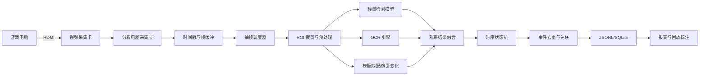

# 02. 总体技术架构

## 1. 推荐数据流



## 2. 六个核心模块

### 采集层 Capture

负责从采集卡获得帧，附加 `timestamp_ms`、`frame_index`、`source_id`。不要在这里做 OCR 或业务判断。

### 抽帧层 Sampling

按目标处理频率取帧。例如视频 60 FPS，但检测只处理 5～10 FPS；进入战斗、UI 发生显著变化时可以临时提高频率。

### 感知层 Perception

调用 YOLO、OCR、模板匹配和图像差分，输出机器可读的观察结果。每个观察都带模型版本和置信度。

### 融合层 Fusion

将多个算法的结果按空间、时间和类别合并。例如“战斗标志检测到”与“战斗区域 OCR 读到回合文字”共同确认战斗开始。

### 状态机 Event State Machine

维护 `current_scene`、`current_panel`、`battle_state`、`last_map_name` 等状态，只有满足进入/退出条件才生成事件。

### 存储与展示 Storage

第一版使用 JSONL，便于追加和调试；需要查询、去重、关联时使用 SQLite；大规模离线分析再考虑 Parquet。

## 3. 进程建议

第一版可以单进程、线程内流水线：

```text
capture thread → bounded queue → inference worker → event writer
```

队列必须有上限。分析速度跟不上采集速度时，应丢弃旧帧或降低采样率，而不是无限堆积内存。

稳定版可以拆成：

- `capture_service`：采集和时间戳。
- `perception_service`：检测、OCR、预处理。
- `event_service`：状态机和持久化。
- `review_tool`：回放、修正和标注。

但不要过早微服务化。单机项目先以模块边界清晰为优先。

## 4. 必须记录的可观测指标

- 输入 FPS、处理 FPS、丢帧数。
- 采集时间戳与处理时间戳。
- 每个模型的耗时。
- OCR 调用次数和耗时。
- 每类观察的置信度。
- 状态机当前状态和状态转移原因。
- 输出事件数、去重数和人工修正数。

这些指标能回答“识别错了”究竟是采集错、抽帧错、模型错、OCR 错还是规则错。
