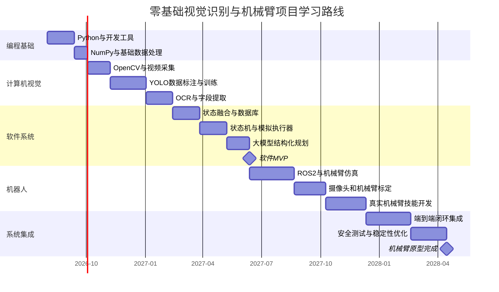
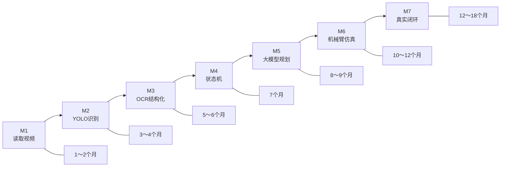

# 零基础视觉识别、大模型与机械臂项目学习规划

> 适用目标：从零开始学习并实现“视频/摄像头采集 → YOLO目标检测 → OCR文字识别 → 数据结构化 → 大模型规划 → 状态机执行 → 机械臂操作 → 视觉验证”的完整项目。
>
> 时间基准：从 **2026年7月27日** 起，每周投入约 **10小时**。

---

## 一、需要多长时间

这并不是只学习一个 YOLO 模型，而是一个包含以下内容的综合项目：

- Python 编程
- OpenCV 图像处理
- YOLO 目标检测
- OCR 文字识别
- 数据库与状态机
- 大模型结构化调用
- ROS 2 与机械臂
- 摄像头标定与安全控制

### 总体时间参考

| 目标 | 预计时间 | 最终能做到什么 |
|---|---:|---|
| 看懂并运行现成 YOLO 代码 | 1～2个月 | 对图片、视频进行目标识别 |
| 软件版最小系统 | 4～6个月 | 视频采集 → YOLO → OCR → 结构化 JSON |
| 完整软件闭环 MVP | 7～9个月 | 识别 → 状态判断 → 大模型规划 → 模拟执行 |
| 机械臂闭环原型 | 12～18个月 | 摄像头识别 → 规划 → 机械臂按键/点击 → 视觉验证 |
| 比较稳定的工程化系统 | 18～24个月 | 异常处理、日志、安全、重复测试和部署 |

### 按每周投入时间估算

| 每周投入 | 软件 MVP | 机械臂端到端原型 |
|---:|---:|---:|
| 5小时 | 8～12个月 | 18～24个月 |
| **10小时** | **6～9个月** | **12～18个月** |
| 20小时 | 4～6个月 | 8～12个月 |
| 全职学习 | 3～4个月 | 6～9个月 |

这里的“学会”不是指把所有理论都学完，而是指：

> 能借助文档和 AI 编程工具，独立搭建、调试和改进一个实际原型。

如果要求完全不依赖 AI 辅助、所有代码都独立手写，时间可能再增加 30%～50%。

---

## 二、总体学习路线图



这个计划大约到 **2027年年底** 形成一套相对完整的原型。但不需要等一年多才看到结果：通常第一个月就能看到画面处理效果，第 3～4 个月就能训练出第一个自己的 YOLO 模型。

---

# 三、分阶段学习规划

## 第0阶段：缩小项目目标

**时间：1周**

不要一开始就设定“让机械臂完成所有任务”。第一个项目目标应该缩小成：

> 从一段录制视频中，识别任务窗口和任务文字，最终输出 JSON 数据。

例如输出：

```json
{
  "timestamp": "2026-08-01T20:15:00+08:00",
  "scene": "normal_game",
  "task_panel_visible": true,
  "task_text": "前往指定地点寻找目标",
  "target_name": "某个NPC",
  "confidence": 0.91
}
```

这一阶段需要确定：

1. 第一版要识别哪些目标；
2. 哪些数据使用 YOLO 识别；
3. 哪些数据使用 OCR 识别；
4. 输出什么 JSON 格式；
5. 什么情况下算成功。

### 第一版只做5类目标

```text
task_panel
confirm_button
close_button
map
dialog
```

不要一开始标注：

- 每一个 NPC；
- 每一个地图；
- 每一个物品；
- 每一种任务；
- 键盘上的每一个按键。

类别越多，数据采集和维护成本越高。

---

## 第1阶段：Python和开发工具

**时间：4～6周**

### 需要学习的内容

#### Python基础

- 变量和数据类型
- `if/else`
- `for/while`
- 函数
- 列表、字典、元组
- 文件读写
- JSON
- 异常处理
- 类的基本概念
- 模块和包
- `pip`
- 虚拟环境

#### 开发工具

- VS Code 或 PyCharm
- PowerShell 基础命令
- Git 基础
- GitHub 仓库
- 断点调试
- 查看日志
- 安装和管理 Python 包

#### NumPy基础

重点学习：

- 数组形状 `shape`
- 数组切片
- 坐标
- 图像数组
- 数据类型
- 矩阵的基本概念

### 这一阶段不需要深入学习

- 微积分
- 神经网络公式推导
- C++
- 操作系统原理
- 算法竞赛
- 从零实现卷积神经网络

### 阶段项目

编写一个程序：

```text
读取一张图片
→ 裁剪指定区域
→ 在图片上画框
→ 添加文字
→ 保存结果
→ 将信息写入JSON文件
```

### 验收标准

能够理解并修改下面这样的代码：

```python
import json
import cv2

image = cv2.imread("test.jpg")

task_region = image[100:400, 700:1100]
cv2.imwrite("task_region.jpg", task_region)

result = {
    "image_width": image.shape[1],
    "image_height": image.shape[0],
    "task_region": [700, 100, 1100, 400]
}

with open("result.json", "w", encoding="utf-8") as file:
    json.dump(result, file, ensure_ascii=False, indent=2)
```

---

## 第2阶段：OpenCV与视频采集

**时间：4～5周**

### 需要学习的内容

- 图片读取与保存
- 视频读取
- 摄像头读取
- FPS 概念
- 图像缩放
- 图像裁剪
- 颜色空间
- 阈值化
- 边缘检测
- 模板匹配
- 透视变换
- 鼠标事件
- 画框和文字
- 摄像头标定的基本概念

### 学习顺序

```text
静态图片
→ 本地视频文件
→ 摄像头
→ 屏幕采集
→ OBS虚拟摄像头
```

### 阶段项目

完成：

```text
OBS或视频文件
→ Python读取画面
→ 每秒处理5帧
→ 裁剪任务区域
→ 显示实时画面
→ 按下S保存当前帧
```

### 验收标准

程序可以连续运行 30 分钟，并且：

- 不崩溃；
- 能显示 FPS；
- 能保存截图；
- 能裁剪指定区域；
- 能处理窗口大小变化；
- 能按时间记录日志。

---

## 第3阶段：YOLO目标检测

**时间：6～8周**

这是第一个核心阶段。

### 需要学习的概念

- 图片和标签
- 类别 `class`
- 检测框 `bounding box`
- 训练集、验证集、测试集
- 预训练模型
- 迁移学习
- Epoch
- Batch Size
- 图片尺寸
- 置信度
- IoU
- Precision
- Recall
- mAP
- 过拟合
- 数据增强

### 实践步骤

#### 第一步：运行预训练模型

先让现成模型识别一张普通图片。

#### 第二步：创建小数据集

自己采集 100～300 张截图，先标注 3～5 类：

```yaml
names:
  0: task_panel
  1: confirm_button
  2: close_button
  3: map
  4: dialog
```

#### 第三步：训练小模型

优先使用 nano 或 small 级别的轻量模型。

#### 第四步：在新视频上测试

不要只看训练数据上的效果，应录制一段没有参加训练的视频测试。

#### 第五步：分析错误

将错误分成：

- 漏检；
- 误检；
- 位置不准；
- 小目标识别失败；
- 界面缩放后失败；
- 弹窗遮挡后失败。

### 阶段项目

```text
输入游戏或模拟界面视频
→ YOLO识别任务面板、按钮、地图
→ 实时画框
→ 输出类别、坐标和置信度
```

输出示例：

```json
{
  "objects": [
    {
      "class": "task_panel",
      "bbox": [705, 106, 1120, 486],
      "confidence": 0.94
    },
    {
      "class": "close_button",
      "bbox": [1082, 111, 1112, 141],
      "confidence": 0.91
    }
  ]
}
```

### 验收标准

建议至少满足：

- 在未参加训练的视频上测试；
- 连续测试 10～30 分钟；
- 固定 UI 目标识别成功率达到 90% 左右；
- 置信度不足时不输出确定结论；
- 能保存误检和漏检截图；
- 能够重新添加数据并训练第二版模型。

---

## 第4阶段：OCR文字识别

**时间：4～6周**

### 需要学习的内容

- 文本检测
- 文本识别
- ROI 区域裁剪
- 图像放大
- 灰度化
- 二值化
- 锐化
- OCR 置信度
- 正则表达式
- 字典匹配
- 错别字纠正
- 坐标和数字提取

### 正确处理方式

不要让 OCR 扫描整个画面：

```text
YOLO找到任务面板
→ 裁剪任务文字区域
→ 放大2倍
→ 图像预处理
→ OCR
→ 正则表达式提取字段
```

例如 OCR 结果：

```text
请前往长安城（325，118）寻找王大嫂
```

转换为：

```json
{
  "task_type": "find_npc",
  "scene": "长安城",
  "coordinate": [325, 118],
  "target_name": "王大嫂"
}
```

### 阶段项目

实现：

```text
YOLO定位任务面板
→ OCR读取任务文字
→ 正则提取地点、坐标、目标
→ 写入JSON和SQLite
```

### 验收标准

- 关键文字字段准确率达到 90% 以上；
- 坐标、数字等关键字段达到 95% 左右；
- OCR 失败时保留原始截图；
- 不确定结果带置信度；
- 同一个画面不重复执行 OCR；
- 能使用词典纠正常见错字。

---

## 第5阶段：状态融合、数据库和可视化

**时间：4～6周**

### 需要学习的内容

- JSON 数据结构
- Python 数据类
- SQLite
- SQL 基本查询
- 日志
- 时间戳
- 状态缓存
- 去重
- 多帧投票
- 简单 Web 接口
- Streamlit 或 FastAPI 基础

### 为什么需要多帧融合

不能因为一帧检测不到按钮，就判断按钮已经消失。

可以使用：

```text
连续3帧检测到 → 确认为存在
连续5帧检测不到 → 确认为消失
```

状态数据示例：

```json
{
  "scene": {
    "value": "normal_game",
    "confidence": 0.96
  },
  "task_panel": {
    "visible": true,
    "stable_frames": 8
  },
  "task": {
    "type": "find_npc",
    "target_name": "王大嫂",
    "ocr_confidence": 0.89
  }
}
```

### 阶段项目

建立一个只读数据面板，展示：

- 当前场景；
- 当前任务；
- YOLO 识别结果；
- OCR 文字；
- 处理 FPS；
- 最近错误；
- 任务历史记录；
- 每类目标识别次数。

### 验收标准

系统连续运行 1～2 小时：

- 数据不重复写入；
- 视频处理不中断；
- OCR 不会每帧运行；
- 异常会写入日志；
- 数据库能够查询历史记录；
- 页面可以实时看到状态。

完成这个阶段后，你已经拥有一个有实际价值的 **只读视觉数据系统**。

---

# 四、软件闭环阶段

## 第6阶段：规则、状态机和模拟执行器

**时间：5～6周**

这是连接“识别”和“操作”的关键阶段。

### 需要学习的内容

- 有限状态机 FSM
- 行为树的基本概念
- 前置条件
- 超时
- 重试
- 回滚
- 动作白名单
- 幂等性
- 人工确认
- 安全停止

### 一定先做模拟执行器

模拟执行器不控制真实键盘和机械臂，只打印动作：

```text
[模拟] 打开任务面板
[模拟] 等待任务窗口
[模拟] 读取任务文字
[模拟] 移动到确认按钮
[模拟] 单击
```

状态机示例：

```text
IDLE
  ↓
OBSERVE
  ↓
READ_TASK
  ↓
PLAN
  ↓
WAIT_FOR_CONFIRMATION
  ↓
MOCK_EXECUTE
  ↓
VERIFY
  ↓
COMPLETED
```

### 阶段项目

制作一个自己控制的模拟窗口：

- 有按钮；
- 有任务文字；
- 会随机出现弹窗；
- 点击后改变状态；
- 可以测试状态机；
- 不连接真实网络游戏。

### 验收标准

运行 100 次模拟任务：

- 成功率达到 90% 以上；
- 每个动作都有前置条件；
- 所有动作都有超时；
- 连续失败后会停止；
- 未知窗口不会操作；
- 可以随时手动急停；
- 所有操作都有日志和截图。

---

## 第7阶段：大模型接入

**时间：3～5周**

大模型是高层规划模块，不是机械臂控制器。

### 需要学习的内容

- Prompt 基础
- 上下文
- 结构化 JSON 输出
- JSON Schema
- Tool Calling
- 大模型幻觉
- 超时与重试
- 本地模型或 API 调用
- 输出验证
- 动作白名单
- 人工确认机制

### 第一版只让大模型做两件事

#### 1. 任务文字分类

输入：

```json
{
  "task_text": "前往长安城寻找王大嫂"
}
```

输出：

```json
{
  "task_type": "find_npc",
  "target_scene": "长安城",
  "target_name": "王大嫂"
}
```

#### 2. 从技能库中选择动作

输入：

```json
{
  "goal": "读取当前任务",
  "state": {
    "task_panel_visible": false,
    "dialog_visible": false
  },
  "allowed_skills": [
    "open_task_panel",
    "close_dialog",
    "read_task_text",
    "stop"
  ]
}
```

输出：

```json
{
  "skill": "open_task_panel",
  "reason": "任务面板当前没有显示"
}
```

### 阶段项目

```text
视觉状态
→ 大模型输出JSON计划
→ JSON Schema校验
→ 规则校验
→ 模拟执行
→ 视觉验证
```

### 验收标准

- 大模型不能输出白名单之外的动作；
- JSON 不合法时拒绝执行；
- 单次最多生成 3～5 个动作；
- 敏感状态必须人工确认；
- 大模型超时不会导致系统卡死；
- 模型服务断开时系统可以安全停止；
- 相同输入基本得到一致、可验证的结果。

完成这一阶段，大约是学习开始后的 **7～9个月**，你就拥有了完整的软件 MVP。

---

# 五、机械臂阶段

## 第8阶段：ROS 2和机械臂仿真

**时间：8～10周**

### 建议先使用Ubuntu仿真

机器人部分建议使用：

- Ubuntu
- ROS 2
- RViz
- Gazebo 或厂商仿真环境
- MoveIt 2
- Python 控制接口

### 需要学习的内容

- Linux 命令基础
- ROS 2 节点
- Topic
- Service
- Action
- TF 坐标系
- URDF
- 关节和末端执行器
- 正运动学
- 逆运动学
- RViz
- 运动规划
- 碰撞检测

### 阶段项目

在仿真环境中完成：

```text
机械臂回到Home位置
→ 移动到键盘上方
→ 下降
→ 模拟按键
→ 抬起
→ 返回Home位置
```

### 验收标准

- 不连接真实机械臂也能运行；
- 可以发送目标位姿；
- 可以取消运动；
- 遇到碰撞规划失败；
- 超出工作空间时拒绝执行；
- 能读取机械臂当前状态。

---

## 第9阶段：摄像头与机械臂标定

**时间：5～7周**

这是项目中容易低估的难点。

### 需要学习的内容

- 相机内参
- 畸变校正
- 透视变换
- 坐标系
- 齐次变换矩阵
- ArUco 或 ChArUco 标记
- 手眼标定
- 像素坐标
- 世界坐标
- 机械臂基座坐标
- 末端执行器坐标

### 阶段项目

```text
摄像头识别键盘四角标记
→ 计算键盘坐标系
→ 获取某个按键的位置
→ 转换成机械臂目标位置
→ 机械臂移动到按键上方
```

暂时不真正按下，只移动到上方。

### 验收标准

- 重复定位同一个按键 20 次；
- 位置误差不会不断累积；
- 键盘轻微移动后能重新标定；
- 摄像头移动后会判定标定失效；
- 标定失效时机械臂不动作。

---

## 第10阶段：真实机械臂技能库

**时间：6～9周**

### 第一批机械技能

```text
return_home
move_above_key
press_key
press_hotkey
move_mouse
left_click
right_click
scroll
emergency_stop
```

建议先完成：

1. 单键按压；
2. 两个按键组合；
3. 固定位置鼠标点击；
4. 视觉目标点击；
5. 执行结果验证。

### 阶段项目

在自建模拟界面里：

```text
摄像头发现“确认”按钮
→ 大模型选择click_target技能
→ 规则校验
→ 机械臂移动实体鼠标
→ 点击
→ 摄像头确认按钮消失
```

### 验收标准

- 固定按键 100 次成功率达到 95% 以上；
- 点击失败会停止或重试；
- 重试最多 2 次；
- 压力或下降深度受限制；
- 摄像头丢失立即停止；
- 机械臂工作区域有硬件急停；
- 执行过程中可以人工取消。

---

# 六、系统集成阶段

## 第11阶段：端到端集成

**时间：8～12周**

完整链路：

```text
摄像头/OBS
→ OpenCV预处理
→ YOLO
→ OCR
→ 状态融合
→ 大模型规划
→ 规则校验
→ 状态机
→ 机械臂技能
→ 机械臂执行
→ 摄像头验证
```

### 重点测试场景

- 画面加载慢；
- OCR 识别错误；
- YOLO 漏检；
- 多个相似按钮；
- 弹窗遮挡；
- 摄像头位置变化；
- 键盘位置变化；
- 机械臂通信断开；
- 大模型输出非法 JSON；
- 大模型服务超时；
- 操作后界面没有变化；
- 人进入机械臂工作区域；
- 急停后重新恢复。

### 最终验收建议

准备 100～500 条测试用例：

| 指标 | 建议目标 |
|---|---:|
| YOLO 关键目标识别成功率 | ≥95% |
| OCR 关键字段准确率 | ≥95% |
| 机械臂固定按键成功率 | ≥98% |
| 模拟端到端成功率 | ≥95% |
| 真实端到端成功率 | 第一版 ≥85%，优化后 ≥95% |
| 未知页面错误操作次数 | 0 |
| 安全规则绕过次数 | 0 |
| 所有动作日志覆盖率 | 100% |

这些数字是项目验收建议，不是算法的统一行业标准，可以根据实际场景调整。

---

# 七、前12周详细执行表

## 第1～4周：Python基础

| 周数 | 学习内容 | 实践作业 |
|---:|---|---|
| 第1周 | 安装 Python、VS Code、Git，变量和打印 | 写一个输出系统状态的程序 |
| 第2周 | 条件、循环、函数 | 遍历图片文件夹，统计图片数量 |
| 第3周 | 列表、字典、JSON | 将图片信息保存为 JSON |
| 第4周 | 文件、异常、模块 | 编写可以处理错误图片的工具 |

每周至少写 3 个小程序，不要只看视频。

## 第5～8周：NumPy和OpenCV

| 周数 | 学习内容 | 实践作业 |
|---:|---|---|
| 第5周 | NumPy 数组和图像坐标 | 裁剪图片区域 |
| 第6周 | OpenCV 读写、缩放、画框 | 制作图片标记程序 |
| 第7周 | 视频读取、FPS | 播放视频并显示帧率 |
| 第8周 | 摄像头或 OBS 输入 | 实时保存截图 |

## 第9～12周：第一个YOLO实验

| 周数 | 学习内容 | 实践作业 |
|---:|---|---|
| 第9周 | 运行预训练 YOLO | 对图片和视频进行预测 |
| 第10周 | 标注概念、YOLO 标签格式 | 标注 50～100 张截图 |
| 第11周 | 训练、验证、置信度 | 训练第一个 3 类别模型 |
| 第12周 | 误检与漏检分析 | 补充难例，训练第二个版本 |

### 12周目标

```text
视频输入
→ 自己训练的YOLO模型
→ 实时画框
→ 输出JSON
```

如果能完成这一点，说明学习路线是可行的。

---

# 八、推荐的每周时间安排

以每周 10 小时为例：

| 内容 | 每周时间 |
|---|---:|
| 教程和基础知识 | 2小时 |
| 跟着示例敲代码 | 2小时 |
| 自己的项目开发 | 4小时 |
| 调试和记录问题 | 1小时 |
| 复盘、整理文档 | 1小时 |

推荐采用：

> **20% 学习教程，70% 动手做项目，10% 整理总结。**

不要出现这种情况：

```text
连续三个月看课程
→ 一行项目代码都没有写
```

正确方式是：

```text
学习图片读取
→ 当天接入自己的截图

学习视频处理
→ 当天接入自己的录像

学习YOLO
→ 当周开始标注自己的数据

学习OCR
→ 当周读取自己的任务区域
```

---

# 九、可以暂缓学习的内容

为了防止范围失控，第一年可以暂缓：

- 从零实现 YOLO 网络；
- 深入推导反向传播；
- 自己训练通用 OCR 模型；
- C++ 机器人开发；
- 多机械臂协作；
- 强化学习；
- 端到端视觉动作模型；
- 大型视觉语言模型微调；
- SLAM；
- 强实时操作系统；
- 自制机械臂控制板。

你的目标不是成为每一个方向的专家，而是成为：

> 能把成熟模块合理组合起来，并能调试整个系统的项目开发者。

---

# 十、设备购买时间建议

## 现在不要马上购买机械臂

### 第1～3个月

只使用：

- 现有电脑；
- 录制视频；
- OBS；
- Python；
- OpenCV；
- YOLO；
- OCR。

### 第4～7个月

可以增加：

- 固定支架；
- 普通 1080p 摄像头；
- 补光；
- ArUco 标定板；
- 简单模拟键盘装置。

### 第8个月以后

当下面条件都满足后，再考虑购买机械臂：

- YOLO 已经能稳定识别目标；
- OCR 已经能输出结构化字段；
- 状态机已经运行；
- 大模型输出经过 JSON 校验；
- 模拟执行器通过 100 次测试；
- 能够看懂机械臂 SDK 示例；
- 已经明确机械臂工作范围和末端结构。

否则很容易出现：

> 花很多钱买了机械臂，最后却一直停留在环境安装和 SDK 调试阶段。

---

# 十一、项目里程碑



每个里程碑都有独立价值：

1. **M1**：能够采集和处理视频；
2. **M2**：能够识别 UI 目标；
3. **M3**：能够提取结构化数据；
4. **M4**：能够基于状态产生确定性决策；
5. **M5**：能够理解复杂任务并生成高层计划；
6. **M6**：能够在仿真环境运行机械臂；
7. **M7**：能够完成真实视觉—动作闭环。

---

# 十二、最终时间结论

以零基础、每周 10 小时计算：

- **3个月**：掌握 Python、OpenCV，跑通第一个 YOLO；
- **6个月**：完成视频识别、OCR 和结构化数据；
- **9个月**：完成状态机、大模型规划和模拟执行；
- **12个月**：完成机械臂仿真及基础标定；
- **12～18个月**：完成真实机械臂闭环原型；
- **18～24个月**：将系统优化到比较稳定的工程状态。

最重要的不是先学完所有知识，而是遵循以下顺序：

> **视频文件 → 实时采集 → YOLO → OCR → JSON → 状态机 → 大模型 → 仿真机械臂 → 真实机械臂。**

实际操作部分建议只在 **自建模拟界面、授权测试环境或无第三方服务规则风险的场景** 中进行。第一阶段先完成只读识别和数据化，这既是整套系统的基础，也是最容易在几个月内取得成果的部分。

---

# 十三、推荐学习资料

- [Python 官方教程](https://docs.python.org/3/tutorial/)
- [OpenCV Python 教程](https://docs.opencv.org/master/d6/d00/tutorial_py_root.html)
- [Ultralytics YOLO 模式说明](https://docs.ultralytics.com/modes/)
- [Ultralytics YOLO 检测数据集格式](https://docs.ultralytics.com/datasets/detect/)
- [PaddleOCR 官方文档](https://www.paddleocr.ai/main/en/version3.x/pipeline_usage/OCR.html)
- [OBS 虚拟摄像头指南](https://obsproject.com/kb/virtual-camera-guide)
- [ROS 2 官方教程](https://docs.ros.org/en/jazzy/Tutorials.html)
- [MoveIt 2 官方文档](https://moveit.picknik.ai/)
- [ROS 2 Joint Trajectory Controller](https://control.ros.org/jazzy/doc/ros2_controllers/joint_trajectory_controller/doc/userdoc.html)
